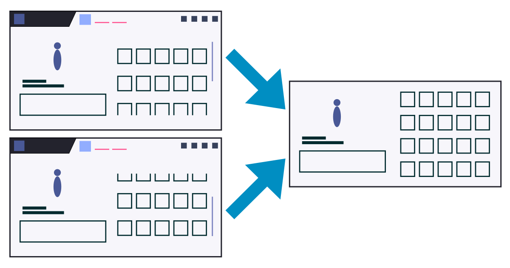

# Unitpic(ウニピク)

## 概要

Unitpic(ウニピク)は、『アサルトリリィ Last Bullet』
(ラスバレ)のユニット編成のスクリーンショットを1枚の画像にまとめるツールです。
Webブラウザ上で動作し、メモリア装備画面の2枚のスクショから、1枚のPNG画像を作成してダウンロードできます。

https://cannoharito.github.io/allb-unitpic/

## 開発

### 必要な環境

- [Deno](https://deno.land/) 2.0以上

### コマンド

- 開発サーバーの起動: `deno task dev`
- コードのフォーマットとリントの確認: `deno task check`
